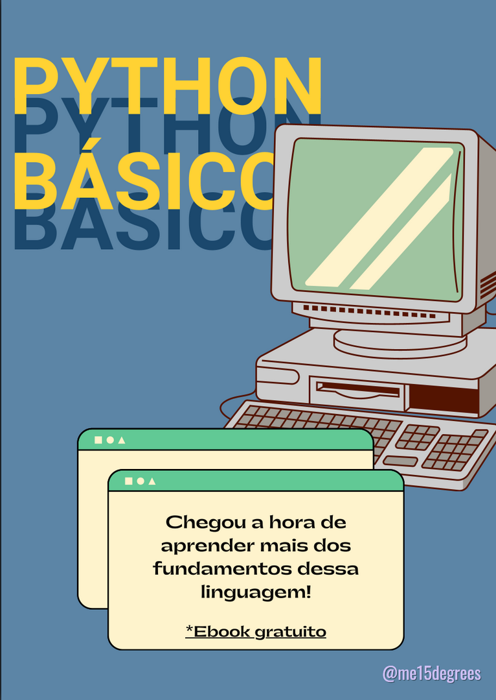

    
    

# Construindo E-BOOKs com auxílio de IA's

> Segundo projeto de desenvolvimento no Bootcamp Santander realizado na plataforma [DIO](https://dio.me)!

Projeto com o objetivo de gerar um E-book digital com as facilidades das ferramentas de IA. Todos os prompts estão disponíveis logo abaixo:

<a href="output/Ebook Python Básico.pdf" title="View PDF now"> 📕Clique aqui para ler</a>

## 💻 Tecnologias utilizadas no projeto

- [ChatGPT](https://chat.openai.com/) 
- [Canva](https://www.canva.com/)

## 🧠 Prompts

ChatGPT：

|   Ação   | prompt                                                                                                                                                                                                                                                                         |
| :------: | ------------------------------------------------------------------------------------------------------------------------------------------------------------------------------------------------------------------------------------------------------------------------------ |
|  Paleta de cores | Crie uma paleta de cores baseado nas cores oficiais do python. REGRAS: 4 cores hexadecimais.                                                       |
| Conteúdo | Crie conteúdos separados em 10 páginas para um e-book que ensina o básico da programação em python. REGRAS: possuir uma sugestão de título por tópico; não ultrapassar de 10 linhas cada explicação; possuir trechos de código exemplificando.

## ✨ Features

- Conteúdo gerado via ChatGPT

## 📚 Materiais

- Imagens utilizadas em `assets`
- Ebook gerado durante as aulas em `output`

## 👨‍💻 Autoria

    
    
&nbsp&nbsp&nbspMaria Eduarda Nascimento Andrade 
    &nbsp&nbsp&nbsp
    <a href="https://github.com/me15degrees">
    GitHub</a>&nbsp;|&nbsp;
    <a href="https://www.linkedin.com/in/maria-eduarda-nascimento-andrade-bb0b86213/">LinkedIn</a>
&nbsp;|&nbsp;
    <a href="https://www.instagram.com/me15degrees/">
    Instagram</a>
&nbsp;|&nbsp;
    <a href="http://lattes.cnpq.br/3152644388678173">
    Currículo Lattes</a>
&nbsp;|&nbsp;

  

---
